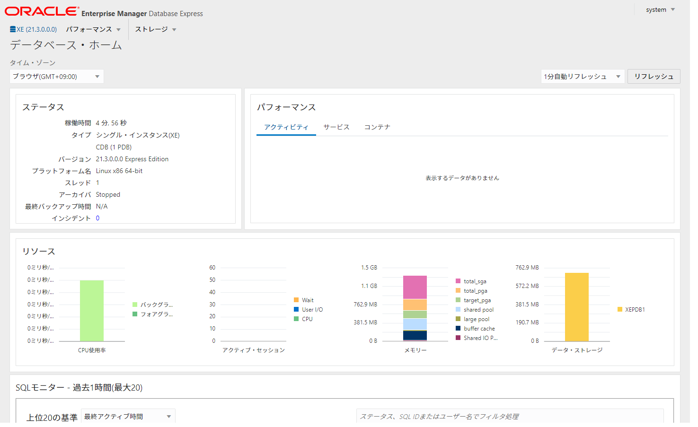

vagrant-oracle-database-xe-21c
==============================

Vagrant + Oracle Linux 7 + Oracle Database 21c XE の簡易セットアップ。

ダウンロード
------------

Oracle Database 21c XEのソフトウェアを[Oracle Database XE Downloads](https://www.oracle.com/database/technologies/xe-downloads.html)からダウンロードし、Vagrantfileと同じディレクトリに配置。

* oracle-database-xe-21c-1.0-1.ol7.x86_64.rpm

カスタマイズ
------------

`dotenv.sample`というファイルを`.env`という名前のファイルにコピーし、必要に応じて内容を書き換える。

```
# SYS, SYSTEM and PDBADMIN password
ORACLE_PASSWORD=oracle
# Specifies whether or not to add the Sample Schemas to your database
ORACLE_SAMPLESCHEMA=TRUE
```

セットアップ
------------

`vagrant up`を実行すると、内部的に以下が動く。

* Oracle Linux 7のダウンロードと起動
* Oracle Database 21c XEのインストール
* データベースの作成
* 環境変数の設定
* 自動起動の設定
* サンプル・スキーマのインストール

```
C:\vagrant-oracle-database-xe-21c>vagrant up
Bringing machine 'default' up with 'virtualbox' provider...
==> default: Box 'oraclelinux/7' could not be found. Attempting to find and install...
    default: Box Provider: virtualbox
    default: Box Version: >= 0
==> default: Loading metadata for box 'https://oracle.github.io/vagrant-projects/boxes/oraclelinux/7.json'
    default: URL: https://oracle.github.io/vagrant-projects/boxes/oraclelinux/7.json
==> default: Adding box 'oraclelinux/7' (v7.9.260) for provider: virtualbox
    default: Downloading: https://yum.oracle.com/boxes/oraclelinux/ol7/OL7U9_x86_64-vagrant-virtualbox-b260.box
    default:
    default: Calculating and comparing box checksum...
==> default: Successfully added box 'oraclelinux/7' (v7.9.260) for 'virtualbox'!
==> default: Importing base box 'oraclelinux/7'...
==> default: Matching MAC address for NAT networking...
==> default: Checking if box 'oraclelinux/7' version '7.9.260' is up to date...
==> default: Setting the name of the VM: vagrant-oracle-database-xe-21c_default_1632282360037_93152
...
...
(ネットワークやサーバーのスペックによっては数十分かかります。)
...
...
    default: SH     PRODUCTS_PROD_SUBCAT_IX              21         72
    default: SH     PROMO_PK                            503        503
    default: SH     SALES_CHANNEL_BIX                     4         92
    default: SH     SALES_CUST_BIX                     7059      35808
    default: SH     SALES_PROD_BIX                       72       1074
    default: SH     SALES_PROMO_BIX                       4         54
    default: SH     SALES_TIME_BIX                     1460       1460
    default: SH     SUP_TEXT_IDX
    default: SH     TIMES_PK                           1826       1826
    default:
    default: 72 rows selected.
    default:
    default: SQL> Disconnected from Oracle Database 21c Express Edition Release 21.0.0.0.0 - Production
    default: Version 21.3.0.0.0

C:\vagrant-oracle-database-xe-21c>
```

動作確認(ブラウザ編)
--------------------

ブラウザで https://localhost:5500/em にアクセスし、Enterprise Manager Expressへログイン。



動作確認(ターミナル編)
----------------------

ゲストOSに接続する。

```
C:\vagrant-oracle-database-xe-21c>vagrant ssh

Welcome to Oracle Linux Server release 7.9 (GNU/Linux 5.4.17-2102.204.4.4.el7uek.x86_64)

The Oracle Linux End-User License Agreement can be viewed here:

  * /usr/share/eula/eula.en_US

For additional packages, updates, documentation and community help, see:

  * https://yum.oracle.com/

[vagrant@localhost ~]$
```

ルートに接続し、接続を確認する。

```
[vagrant@localhost ~]$ sqlplus system/oracle

SQL*Plus: Release 21.0.0.0.0 - Production on Wed Sep 22 03:00:53 2021
Version 21.3.0.0.0

Copyright (c) 1982, 2021, Oracle.  All rights reserved.

Last Successful login time: Wed Sep 22 2021 03:00:04 +00:00

Connected to:
Oracle Database 21c Express Edition Release 21.0.0.0.0 - Production
Version 21.3.0.0.0

SQL> SHOW CON_NAME

CON_NAME
------------------------------
CDB$ROOT
SQL> exit
Disconnected from Oracle Database 21c Express Edition Release 21.0.0.0.0 - Production
Version 21.3.0.0.0
[vagrant@localhost ~]$
```

PDBに接続し、サンプル表を確認する。

```
[vagrant@localhost ~]$ sqlplus system/oracle@localhost/xepdb1

SQL*Plus: Release 21.0.0.0.0 - Production on Wed Sep 22 03:32:07 2021
Version 21.3.0.0.0

Copyright (c) 1982, 2021, Oracle.  All rights reserved.

Last Successful login time: Wed Sep 22 2021 03:32:07 +00:00

Connected to:
Oracle Database 21c Express Edition Release 21.0.0.0.0 - Production
Version 21.3.0.0.0

SQL> SHOW CON_NAME

CON_NAME
------------------------------
XEPDB1
SQL> SELECT JSON_OBJECT(*) FROM hr.employees WHERE rownum <= 3;

JSON_OBJECT(*)
--------------------------------------------------------------------------------
{"EMPLOYEE_ID":100,"FIRST_NAME":"Steven","LAST_NAME":"King","EMAIL":"SKING","PHO
NE_NUMBER":"515.123.4567","HIRE_DATE":"2003-06-17T00:00:00","JOB_ID":"AD_PRES","
SALARY":24000,"COMMISSION_PCT":null,"MANAGER_ID":null,"DEPARTMENT_ID":90}

{"EMPLOYEE_ID":101,"FIRST_NAME":"Neena","LAST_NAME":"Kochhar","EMAIL":"NKOCHHAR"
,"PHONE_NUMBER":"515.123.4568","HIRE_DATE":"2005-09-21T00:00:00","JOB_ID":"AD_VP
","SALARY":17000,"COMMISSION_PCT":null,"MANAGER_ID":100,"DEPARTMENT_ID":90}

{"EMPLOYEE_ID":102,"FIRST_NAME":"Lex","LAST_NAME":"De Haan","EMAIL":"LDEHAAN","P
HONE_NUMBER":"515.123.4569","HIRE_DATE":"2001-01-13T00:00:00","JOB_ID":"AD_VP","
SALARY":17000,"COMMISSION_PCT":null,"MANAGER_ID":100,"DEPARTMENT_ID":90}

JSON_OBJECT(*)
--------------------------------------------------------------------------------


SQL> exit
Disconnected from Oracle Database 21c Express Edition Release 21.0.0.0.0 - Production
Version 21.3.0.0.0
[vagrant@localhost ~]$
```

Author
------

[Shinichi Akiyama](https://github.com/shakiyam)

License
-------

[MIT License](https://opensource.org/licenses/MIT)
